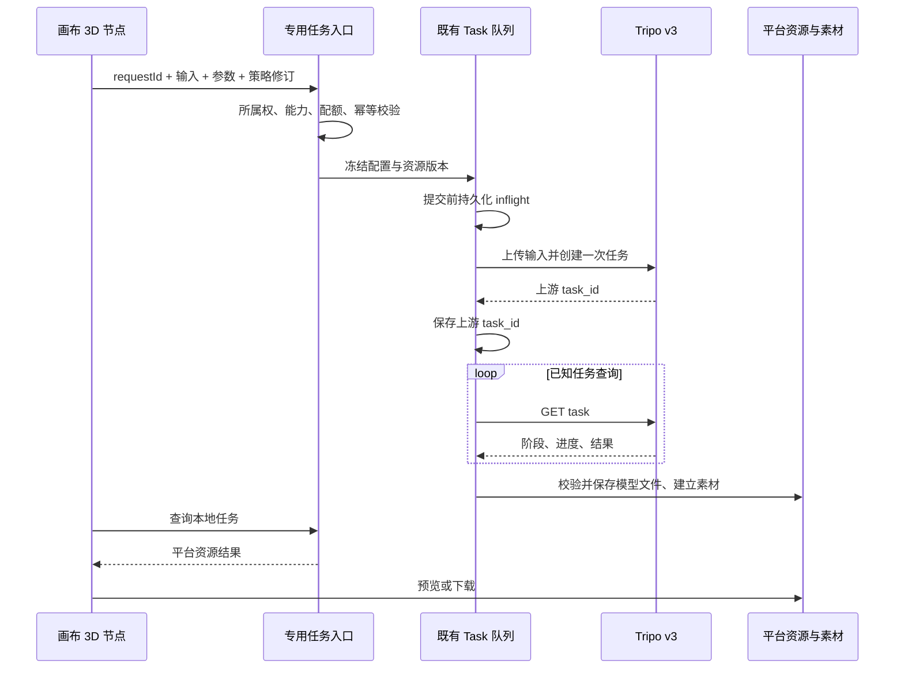

# 画布 3D 模型生成设计

## 目标与调研结论

新增一个内置「3D 模型」节点，支持文本、单图、多视图生成模型文件，在真实画布中预览并下载。服务商由后台配置并激活，当前接入 Tripo3D；沿用图片合规检测的配置版本机制，与系统生成渠道分别管理。

Tripo v3 将三种生成分别暴露为异步接口；ComfyUI 的模式切换和独立预览适合参考，但其旧 SDK 字段不能直接复用。Meshy 的文生模型分预览/精化两步，本功能采用 Tripo 的单任务流程，避免引入用户未要求的第二次生成。完整官方来源、费用和协议差异见 [API 与行业调研](./model3d-api-research.mdx)。

首期实现 H3.1、H3.0、H2.5 的三个生成模式。动画、分部件和另收费的格式转换不在本次范围；下载实际产出的 GLB，四边面模式下载实际 FBX。未来供应商和模型系列应在能力声明与协议适配器中扩展。

## 前端交互

节点沿用平台外壳、标题编辑、连接锚点、主题 token 和参数浮层。新增入口位于画布节点菜单，标题为「3D 模型」，不替换现有图片节点。

1. 选择文本 / 单图 / 多视图模式。文字可直接输入或从文本节点取得；图片可从图片节点选择或上传。
2. 多视图明确绑定正面、左侧、背面、右侧。正面必填，至少两张，最多四张；连接顺序不能代替视角。
3. 常用参数展示模型版本、贴图、PBR、面数和质量；高级区展示随机种子、贴图版本、朝向、UV、四边面、智能低模等当前模型支持的参数。
4. 点击生成时冻结输入与参数快照。运行期间修改草稿不会篡改已提交任务；保留上一结果并展示任务阶段。
5. 成功结果绑定平台资源与素材 ID。默认不创建持续运行的 WebGL 场景；用户激活后可旋转、缩放、重置与放大预览。
6. 下载使用真实格式和平台资源地址；换图、改参数、复制节点、切换账号/画布不误用旧任务响应。

参数约束必须前后端一致。关闭贴图同时关闭 PBR；H2.5 隐藏不支持的高级参数，但保留 UV 和导出朝向；四边面与智能低模约束面数；快速贴图必须选对应贴图版本。去除光照只在贴图 3.5 开启时显示，默认开启，切换版本或关闭贴图时清除该参数；UV 未指定时显示开启，与供应商默认值一致。不可把不适用字段默认发送给供应商。应用创建请求必须显式传入贴图和 PBR 布尔值，不以缺失字段推导用户意图。

## 后台配置

入口 `/admin/settings/model3d`，使用后台隔离主题和设置页布局：

- 服务商：名称、类型、加密 API Key，多套实例。
- 能力：开放模型、默认模型、开放生成模式。
- 调用控制：单次网络请求超时、全局 UTC 日新任务上限。
- 操作：保存新版本、设为生效、停用新任务、归档备用配置。

保存不自动激活，也不请求云端；在途任务冻结旧配置。激活使用 policy revision 防止管理员并发覆盖。密钥留空保留原值，后端只返回已配置标志。用户节点只能读开放能力，不能读凭据。

## 任务和资源链路

复用现有 Task 调度、租约和存储配额，新增专用 admission 与 worker 分支，不塞入文本/图片/视频/音频的模型渠道路由。

`Model3DSubmission` 持久记录用户 requestId、请求摘要、配置快照、提交状态和结果恢复检查点。同用户同 requestId 的相同请求复用任务；不同请求冲突。上游创建 POST 没有已确认的幂等保障，因此发送前持久化 `inflight`，模糊网络失败不自动重发。拿到上游 ID 后所有恢复只查询该任务。文件回存失败仅恢复下载，不再生成。

引用图片写入规范化 resourceId 字段，复用资源删除保护。输入仅接受当前用户已就绪资源。模型验证真实格式，GLB 不允许依赖任意外部 URI；签名下载请求不携带 Tripo Key。结果永久保存平台存储，供应商临时 URL 不进入画布。分享只投影模型结果白名单，不公开凭据、原始输入或配置快照。

## 开发与验收顺序

1. 固定官方协议和前后端 DTO，落实后台配置页面与能力接口。
2. 实现专用队列任务、持久幂等、资源回存和权限边界。
3. 完成三模式节点、参数面板、GLB/FBX 预览、下载、复制与刷新恢复。
4. 离线验证参数矩阵、越权、幂等、未知提交、进程恢复、存储恢复、分享和资源引用；完成前端构建与真实路由验收。
5. 按用户当前要求暂缓真实 API 验证，以官方请求/返回合同复核和离线回归作为本轮验收范围。将来恢复真实验收时，基础三模式纯几何预计合计 50 积分，准确消耗以供应商返回为准；出现协议差异先定位，不盲目重复付费任务。

测试账号、生成素材、截图和临时工具放 Git 忽略的本地目录；密钥仅在真实验收时读取，不写入日志、文档或测试样例。完成状态以实际命令、浏览器、资源文件和任务记录为准，不能用静态原型代替真实页面验证。
